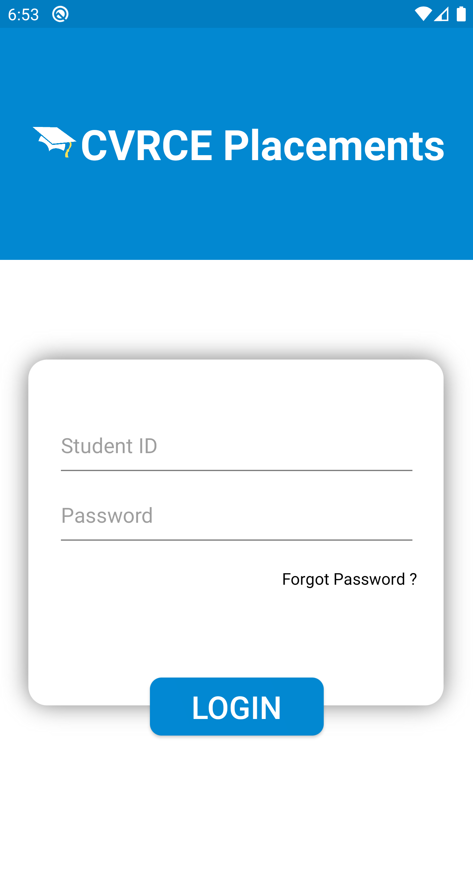
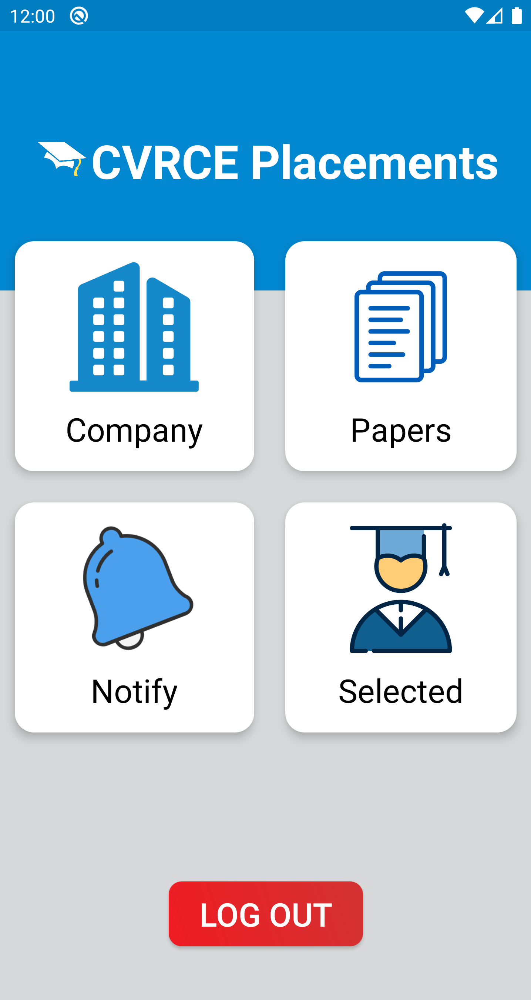
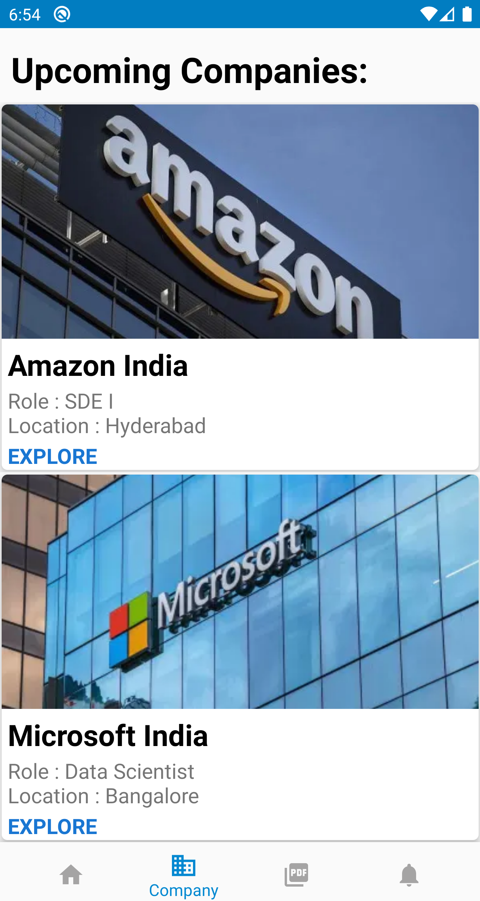
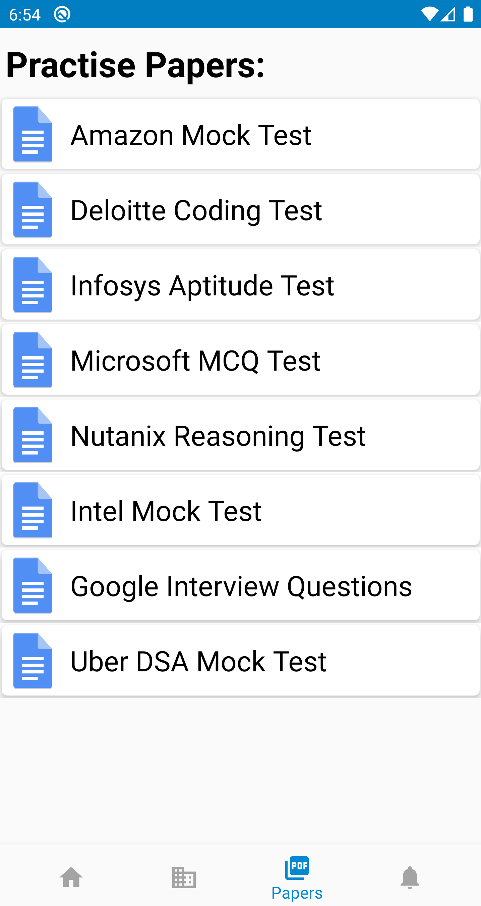
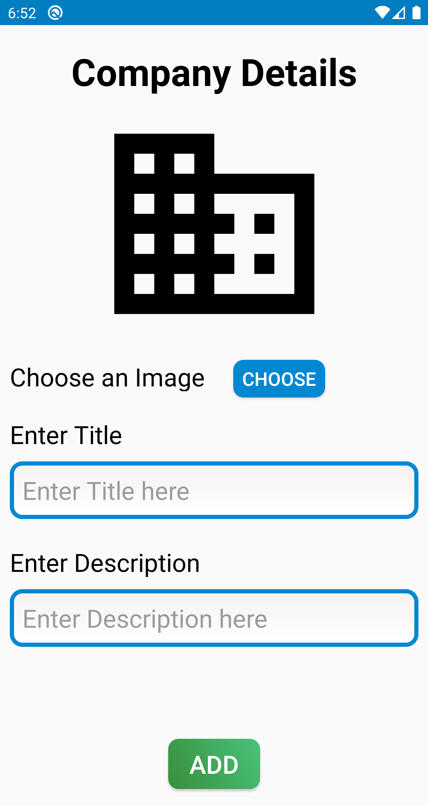
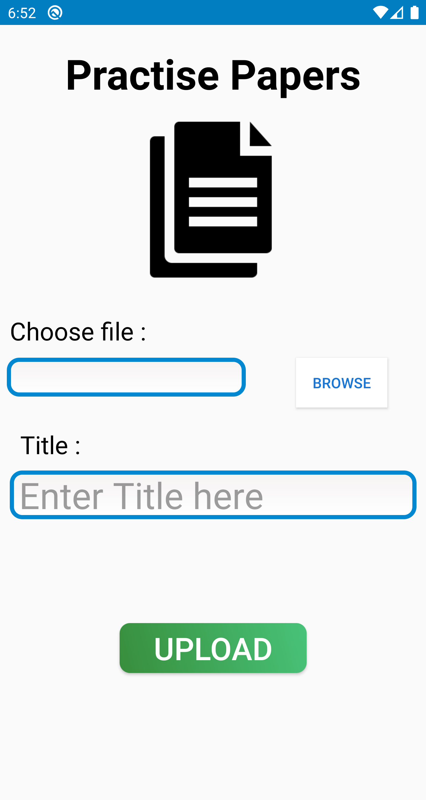
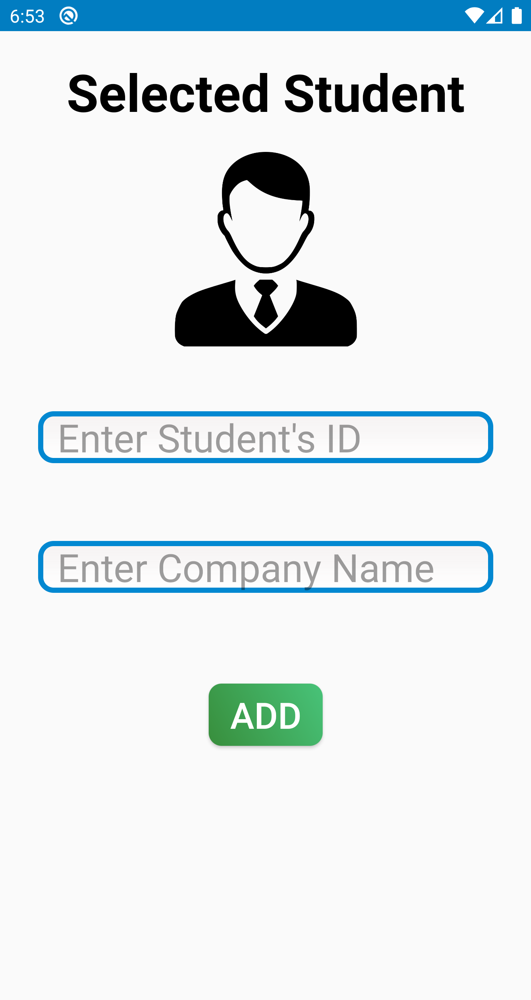
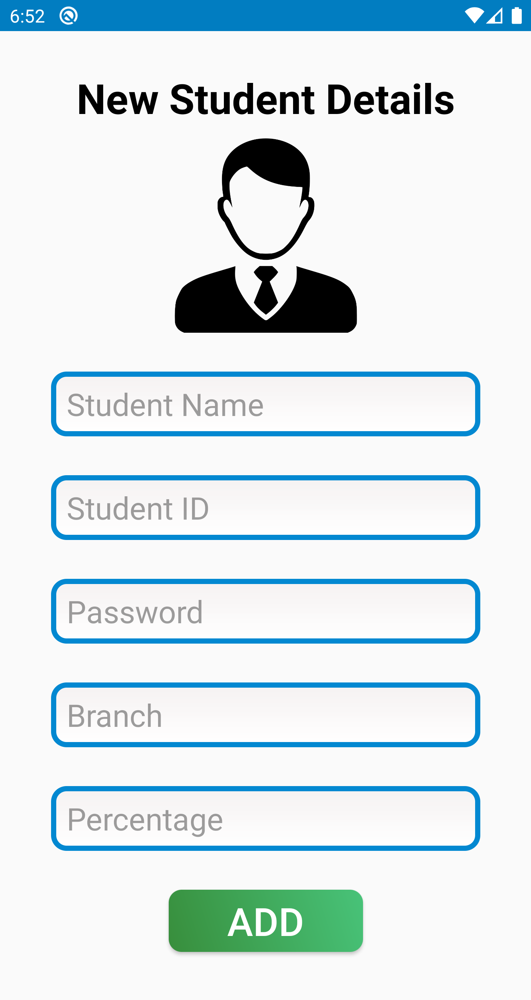

# College Placement App
## About
This is an android application created using Android Studio and Firebase which will help students to be informed about the upcoming companies coming for their placements and practise their mock tests as well.

## Working
The app basically has three kind of users: 

       -> Admin
       
       -> Training & Placement Officer
       
       -> Students

The admin's job is to only add the credentials of TPO and students to the database. By which the added TPO and students will be able to login to the application.

The Training & Placement Officer will be able to add the information regarding the upcoming companies. The data will be directly stored in the Firebase Storage and Firebase Databse.
The data will be retrieved at the student's application from Firebase. The data will be shown in a Recyclerview where each element will be a Cardview.
The TPO will also be able to upload several practise papers of various companies in pdf format which can only be viewed by the students. 
There is also a segment of "Selected Students" which will store the information of students who have been already placed.
The TPO can also notify the students regarding any notice or information. 

The students can log into the app to have a look at the upcoming companies list and also practise their tests.

## Screenshots
      

      

    

## Languages Used

     -> Java 
 
     -> XML
 
 
 
 
